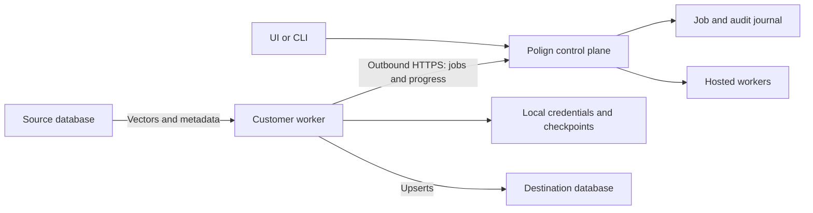
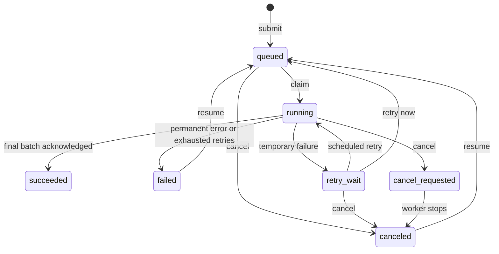

# Architecture

The Go control plane serves the UI, authenticates accounts, and stores jobs.
Transfers run either in its hosted worker pool or in a customer-hosted process.
Set `serve -workers 0` to run only the control plane.

Hosted workers resolve server-side connections. Customer jobs name a registered
worker and locally approved connection pair. They cannot supply endpoints,
credentials, queries, or commands. Customer workers retain their cursors and
batch receipts locally; the control plane stores progress summaries.

## Job state

Hosted restart recovery requeues interrupted jobs. Customer jobs retain their
assignment; after a restart, the same worker waits for its old lease to expire
and resumes from local state. Hosted workers never claim customer jobs.

## Execution

- A checkpoint advances after the destination acknowledges the entire page.
  A crash between write and checkpoint can replay that page. Upserts must be
  idempotent by ID; execution is at least once.
- Transient errors use exponential backoff with jitter, defaulting to five
  attempts per operation. Exhausted attempts schedule a restart after 30 seconds,
  then exponential delays capped at 16 minutes. New jobs allow three restarts.
  Resume resets that budget; `max_restarts: -1` disables automatic restarts.
- Cancellation is cooperative. An in-flight write may finish, and partial writes
  can exist beyond the checkpoint. Cancellation does not roll back data.
- Hosted workers serialize jobs targeting the same configured resource within
  their process. Each customer worker runs one job at a time. There is no shared
  destination lock across different workers, hosted jobs, or external writers.
- `succeeded` means all pages were acknowledged. Counts measure acknowledged
  source records, not unique-ID reconciliation or destination search visibility.

## Worker leases

Customer workers long-poll for 15 seconds when idle and report progress every
five seconds while running. Leases last 60 seconds. The worker stops on a failed
control-plane request or local lease timeout; stale lease reports are rejected.
The UI marks a worker offline after 45 seconds without contact.

Leases protect job state, not database writes already in flight. Jobs are not
automatically reassigned. Missing or outdated local checkpoints cause a failure.
See [worker recovery](customer-workers.md#recovery).

## Storage and audit

Each job transition and audit event shares one fsynced journal line. A file lock
allows one process per data directory. Startup checks the hash chain and drops
an incomplete final line. Write failures stop execution.

Hosted audit records include actor, state, time, counts, and batch hashes.
Customer job reports exclude payloads, provider cursors, raw errors, and batch
hashes; detailed receipts stay on the worker. The hash chain detects corruption,
but an administrator who can rewrite the journal can recompute it.

Current job state stays in memory; startup and audit queries scan the journal.
There is no compaction or horizontal control-plane replication. Browser and
worker sessions are memory-only. See [security](accounts-and-security.md) and
[deployment backups](../deploy/README.md#back-up-and-restore).
